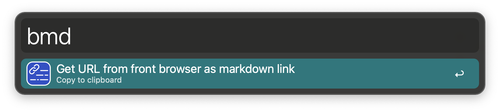
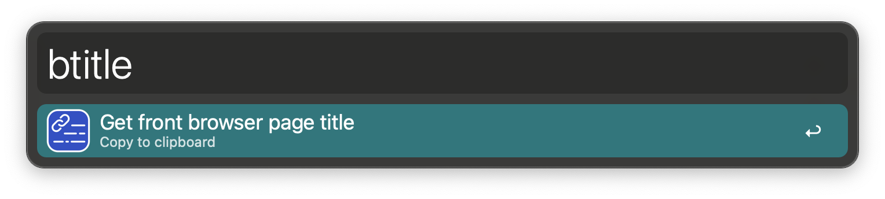
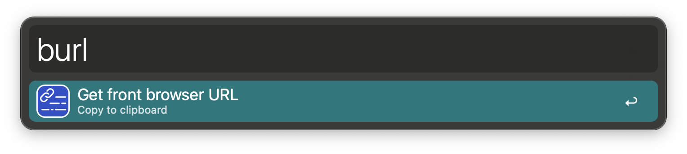
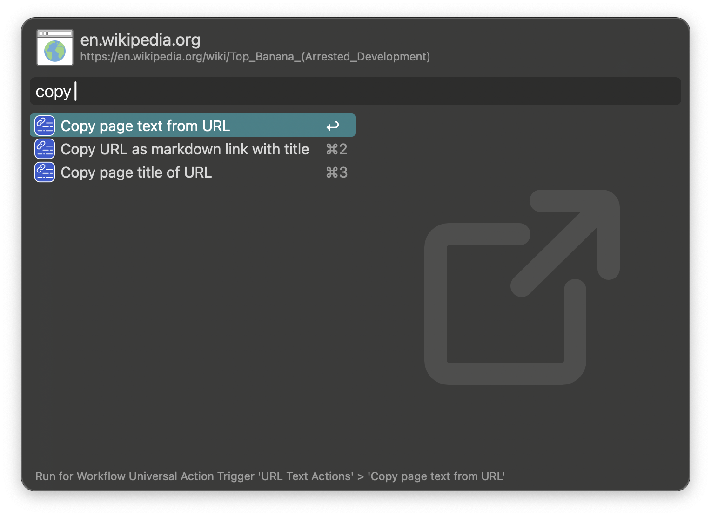
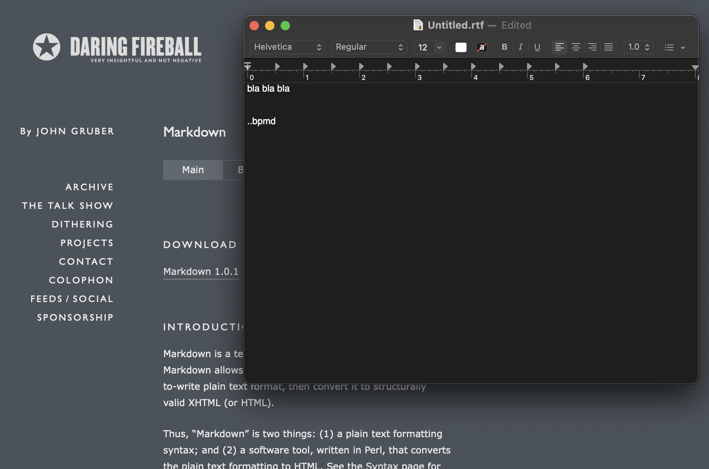
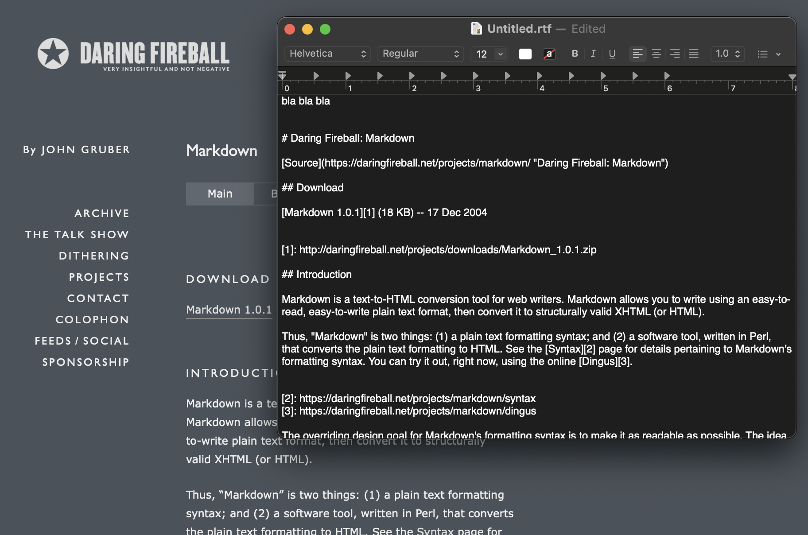

# URL Text Actions - Alfred workflow

This workflow provides actions for getting text from the browser or a URL.

From the frontmost browser tab or with a URL selected, get the page text as markdown, a markdown link, and more. Paste it automatically with a keyword and modifier, a Snippet Trigger, or a Universal Action.

[Alfred forum thread](https://www.alfredforum.com/topic/23116-url-text-actions/)

## Setup

Install Brett Terpstra's [Gather CLI](https://brettterpstra.com/projects/gather-cli/) service, which is required for the actions that get the page text or title from the web.

## Usage

Copy the front browser page text as markdown via the `bpmd` keyword.

- <kbd>⌘</kbd> to immediately paste the text.
- Or use the Snippet Trigger `..bpmd` to immediately paste the text.
- Or pass a URL via the [Universal Action](https://www.alfredapp.com/help/features/universal-actions/).

Copy the URL from front browser as markdown link via the `bmd` keyword.

- <kbd>⌘</kbd> to immediately paste the text.
- Or use the Snippet Trigger `..bmd` to immediately paste the text.
- Or pass a URL via the [Universal Action](https://www.alfredapp.com/help/features/universal-actions/).

Copy the front browser page title via the `btitle` keyword.

- <kbd>⌘</kbd> to immediately paste the text.
- Or use the Snippet Trigger `..btitle` to immediately paste the text.
- Or pass a URL via the [Universal Action](https://www.alfredapp.com/help/features/universal-actions/).

Copy the front browser URL via the `burl` keyword.

- <kbd>⌘</kbd> to immediately paste the text.
- Or use the Snippet Trigger `..burl` to immediately paste the text.

Universal Actions (as described above):

(Copying and pasting a URL is not available as a Universal Action, since it's trivial to do that via the keyboard)

Snippet Trigger example:

## Credits

Based on a [workflow](https://www.alfredforum.com/topic/17176-browser-safari-snippets-and-universal-actions) by [Derick Fay](https://www.alfredforum.com/profile/3468-dfay/)

Brett Terpstra's [Gather-CLI](https://brettterpstra.com/projects/gather-cli/) is one of many, many [projects](https://brettterpstra.com/projects/) he's produced, many of which are free or donation-ware.

Icon credit: Link vector image from [Humbleicons](https://humbleicons.com). [MIT License](https://github.com/zraly/humbleicons/blob/master/license)
